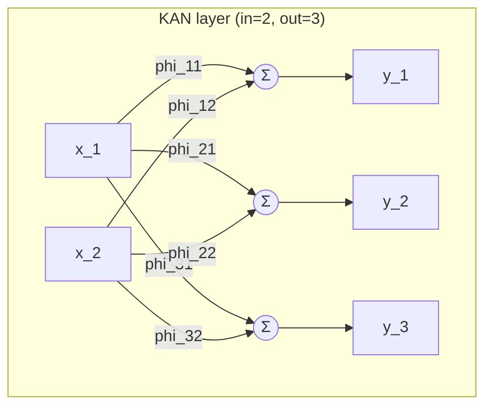

# Track 01 — Kolmogorov-Arnold Networks

**Claim level: `educational implementation`** (see [`docs/claim_policy.md`](../../../../docs/claim_policy.md)).

## Problem statement

A linear layer places a *scalar* on every edge and a fixed nonlinearity on every node:

```text
y_j = sigma( sum_i  w_ji * x_i )
```

Kolmogorov-Arnold Networks invert that arrangement. Every edge carries a *learnable
univariate function*, and every node merely sums:

```text
y_j = sum_i  phi_ji(x_i)
```

The question this track answers is narrow and empirical: on tasks whose structure is a
composition of univariate functions, does moving the nonlinearity onto the edges buy
anything **at a matched parameter budget**, and what does it cost?

## Mathematical formulation

Each edge function is a residual combination of a fixed activation and a learnable
B-spline, following the primary source:

```text
phi_ji(x)      = w_b[j,i] * b(x)  +  spline_ji(x)
b(x)           = silu(x) = x * sigmoid(x)
spline_ji(x)   = sum_{p=0}^{G+k-1} c[j,i,p] * B_p(x)
```

`B_p` are order-`k` B-splines on a knot vector with `G` interior cells, evaluated by the
Cox-de Boor recursion:

```text
B_{i,0}(x) = 1 if t_i <= x < t_{i+1} else 0

B_{i,k}(x) = (x - t_i)/(t_{i+k} - t_i)         * B_{i,k-1}(x)
           + (t_{i+k+1} - x)/(t_{i+k+1} - t_{i+1}) * B_{i+1,k-1}(x)
```

The knot vector is extended by `k` cells on each side, so it holds `G + 2k + 1` knots and
spans `P = G + k` basis functions per edge.

Two facts drive everything downstream:

- **Partition of unity.** For `x` strictly inside the domain, `sum_p B_p(x) = 1`. The
  basis is a convex combination, which is why the coefficients are directly interpretable
  as function values in the degree-1 case.
- **Local support.** `B_{i,k}` is non-zero on at most `k + 1` cells, so a coefficient only
  affects the function near its own knots. Learning is therefore local — an advantage for
  interpretability and a liability for extrapolation.

## Architecture



Each labelled edge expands to:

```text
x ──► SiLU ─────────────► × w_b ──┐
  │                               ├──► phi(x)
  └─► B-spline basis ─► × c ──────┘
```

No activation function sits *between* KAN layers. Adding one would confound the mechanism
under study with a conventional nonlinearity.

## Tensor-shape table

| Symbol | Code | Shape | Meaning |
|---|---|---|---|
| `B` | batch | `(B, ...)` | batch size |
| `n_in` | `in_features` | — | layer input width |
| `n_out` | `out_features` | — | layer output width |
| `G` | `grid_size` | — | interior grid intervals |
| `k` | `spline_order` | — | spline degree |
| `P` | `n_basis` | `G + k` | basis functions per edge |
| `t` | `grid` (buffer) | `(n_in, G + 2k + 1)` | knot vector per input dimension |
| `B_p(x)` | `KANLayer.basis(x)` | `(B, n_in, P)` | evaluated basis |
| `c` | `spline_weight` | `(n_out, n_in, P)` | spline coefficients |
| `w_b` | `base_weight` | `(n_out, n_in)` | residual-branch weights |
| `phi(x)` | `edge_functions(s)` | `(n_out, n_in, S)` | edge functions sampled at `S` points |
| `y` | layer output | `(B, n_out)` | node sums |

## Source-equation to code mapping

| Source concept | Code |
|---|---|
| Cox-de Boor recursion | [`spline.b_spline_basis`](spline.py) |
| extended uniform knot vector | [`spline.build_grid`](spline.py) |
| coefficient fitting / grid refit | [`spline.curve_to_coefficients`](spline.py) |
| adaptive (quantile) grid | [`spline.adaptive_grid`](spline.py) |
| edge function `phi_ji` | [`layers.KANLayer.edge_functions`](layers.py) |
| residual `w_b·silu(x) + spline(x)` | [`layers.KANLayer.forward`](layers.py) |
| node summation | the `linear` contraction inside `forward` |
| grid update during training | [`layers.KANLayer.update_grid`](layers.py) |
| L1 sparsity regularizer | [`layers.KANLayer.regularization`](layers.py) |

## Complexity

For one layer, one example, with `n_in` inputs, `n_out` outputs, `G` cells and order `k`:

| Quantity | KAN layer | Linear layer |
|---|---|---|
| Parameters | `n_in · n_out · (G + k + 1)` | `n_in · n_out + n_out` |
| Basis evaluation | `O(n_in · k · (G + k))` | — |
| Contraction | `O(n_in · n_out · (G + k))` | `O(n_in · n_out)` |
| Memory for the basis | `O(B · n_in · (G + k))` | `O(1)` |

With `G = 5, k = 3` an edge stores **9** numbers where a linear edge stores **1**. Any
comparison at equal *widths* is therefore a comparison at a ~9× capacity advantage. This
track always matches parameter counts instead; see
[`match_parameter_budget`](model.py).

## Numerical stability

| Issue | Handling |
|---|---|
| Repeated knots divide by zero in the recursion | knot spans clamped by `EPS`; adaptive grids additionally enforce `MIN_KNOT_SPACING` between neighbours |
| Quantile grids collapse on constant features | a uniform grid is blended in (`uniform_mixture`), then strict monotonicity is forced |
| Inputs outside the knot domain | the basis decays to zero, so the layer silently falls back to the `SiLU` branch — an *extrapolation* failure that looks like a quiet loss of capacity, not an error |
| An input exactly at the upper domain bound | order 0 uses a half-open cell, so that single point evaluates to all-zero basis |
| Grid resolution vs conditioning | large `G` with few samples per cell makes the least-squares refit ill conditioned |

## Expected failure modes

1. **Extrapolation.** Outside the knot range the spline contributes nothing. KANs
   degrade to their residual branch rather than extrapolating the learned shape.
2. **Grid-size overfitting.** Increasing `G` adds parameters fastest of all knobs; on
   small or noisy data it overfits before it helps.
3. **Sensitivity to input scaling.** The grid is defined on a fixed domain, so unscaled
   inputs land outside it. Standardization is not optional here.
4. **No advantage on unstructured data.** The compositional prior is the whole point; on
   tabular data with no such structure, a tree ensemble is expected to win.

## Known approximations and deviations from the primary source

| # | Deviation | Reason |
|---|---|---|
| 1 | The L1 penalty is applied to **spline coefficients**, not to activations as in the source, and the entropy term is not implemented. | Data-independent, cheaper, and reproducible. It is a *surrogate*, so any sparsity claim is correspondingly weaker. |
| 2 | No separate per-edge `spline_scaler` parameter. | Transparency first; the coefficients already carry the scale. |
| 3 | Spline coefficients are initialized from scaled uniform noise, not by least-squares fitting smooth noise. | The least-squares route made initialization depend on a LAPACK solve whose reduction order is not bitwise stable, so identically seeded runs could differ in the last bits. Determinism was judged more valuable than initial smoothness. |
| 4 | Grid updates are opt-in (`update_grids`) and are not run inside the reported training loop. | Every architecture in a comparison must be optimized by the same loop; a KAN-only mid-training step would confound the mechanism with a bespoke schedule. The behaviour is implemented and tested, and reported separately. |
| 5 | A grid update is function preserving only up to least-squares residual, since the refit projects onto a different spline space. | Measured and bounded in `test_grid_update_moves_knots_but_preserves_the_function` (< 5 % of signal magnitude). |
| 6 | No symbolic regression / pruning / symbolification pipeline. | Out of scope for the mechanism question this track asks. |

## Ablations implemented

| Variant | Flag | What it removes |
|---|---|---|
| `frozen-edge-functions` | `learnable_spline=False` | Learning of the edge functions. The layer becomes a fixed random nonlinear feature map with a learned linear readout — this is the direct test of whether *learned* edges matter. |
| `no-base-branch` | `use_base_branch=False` | The residual `SiLU` path, leaving a pure spline. Isolates how much of the performance comes from the ordinary MLP-like path. |
| `grid-size-*`, `spline-order-*`, `l1-weight-*` | config sweeps | Sensitivity of the mechanism to its own hyperparameters. |

## Reproducing

```bash
poetry run modern-nn run-track kan          # writes results/kan/*.json
poetry run python scripts/plot_kan.py       # figures from saved records only
poetry run modern-nn summarize --track kan
```

The report is [`reports/kan.md`](../../../../reports/kan.md).
